<!-- prettier-ignore-start -->

# Unit 7: Git - GitHub
{: .no_toc }

## Table of Contents
{: .no_toc .text-delta }

1. TOC
{:toc}

<!-- prettier-ignore-end -->

## GitHub

While Git is a version control system you use on your local device,
[GitHub](https://github.com) is a website that allows you to host remote
repositories. It also has cool features which makes collaboration and sharing
code easier on the Internet.

You can technically also use GitHub to edit files in your browser, but generally
developers will do that on a separate application since there are more features
like linting.

You can create an account [here](https://github.com/join).

## Repositories

Let's look at a repository on GitHub to learn some of the different features.

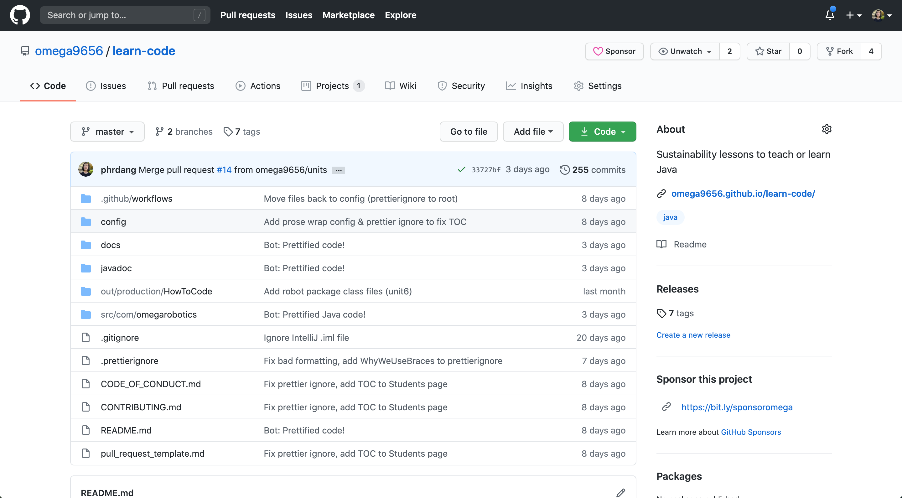

### Menus and Buttons

In the top right, we have the repository owner (omega9656) and name
(learn-code).

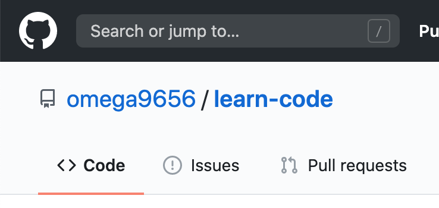

In the top left, we have the sponsor button (if applicable), watch button, star
button, and [fork](#forking) button. Watch allows you to "follow" the
repository. The star allows you to save the repository to your starred
repositories.

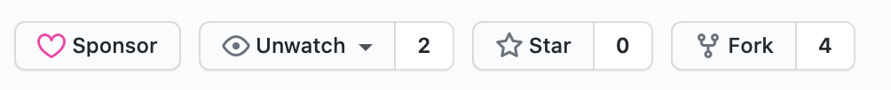

The menu right below the repo name allows you access different features built
into GitHub, such as [Issues](#issues) or [Pull Requests](#pull-requests). You
can also find the repo settings on the far right of the menu.

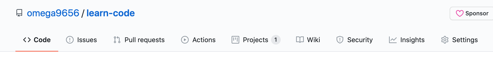

### Sidebar

On the right sidebar, you can do things like:

-   Edit the repo's description, website link, and topics (basically like
    hashtags)
-   View the Readme (by clicking on the link)
-   View releases (see
    [`git tag`](/learn-code/learn/unit7/other-useful-stuff#git-tag))
-   View contributors
-   View languages that the repo is written in

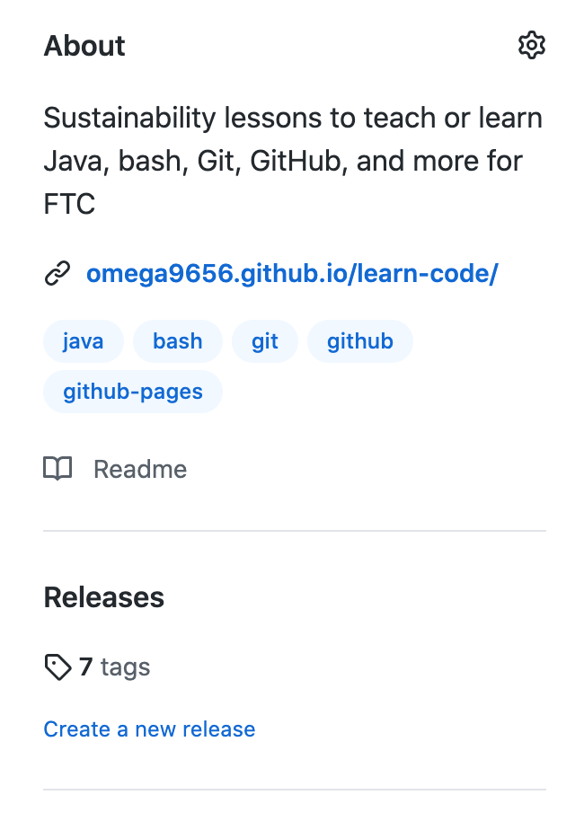

### View Code

In the central area, you can browse through the repo's directories and view
files. You can also see the last commit message for that file/directory and how
long ago that commit occurred.

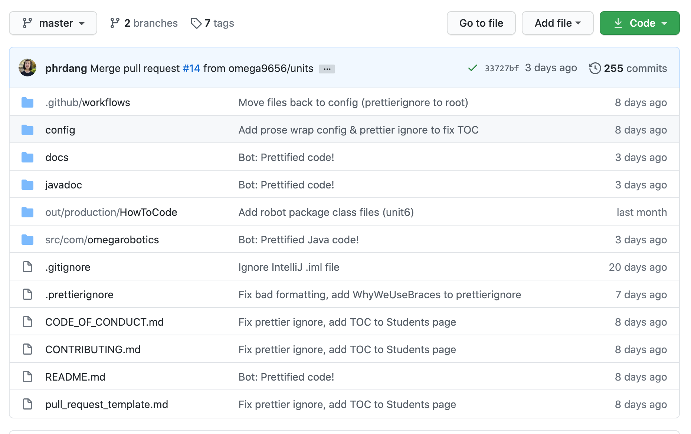

At the top of the file browser is the most recent commit message, its author,
and its hash.

Notice also that on the top left you can switch branches and
[tags](/learn-code/learn/unit7/other-useful-stuff#git-tag) and view all branches
and tags.

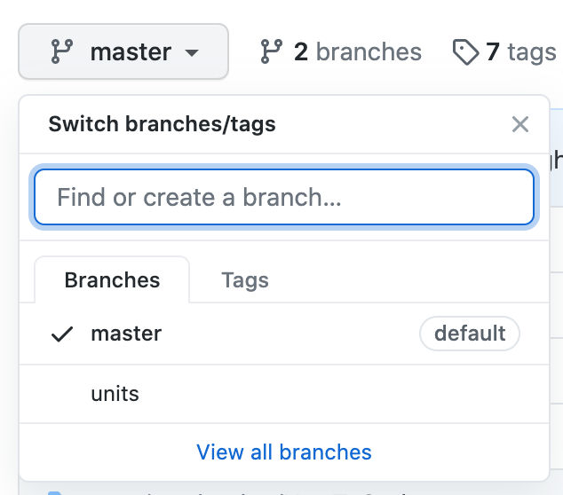

Notice also that on the top right you can click on the green button to download
the code as a ZIP file or copy the repository URL in order clone it via
`git clone`.

To view commit history, click on the top right corner where it tells you the
number of commits made on this repo. It should look something like this:

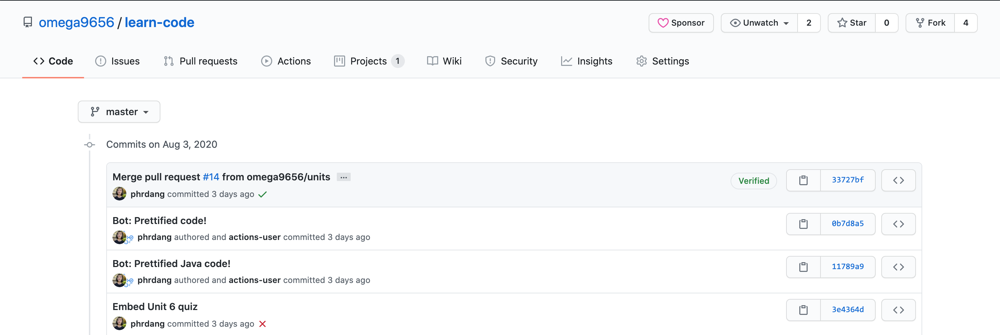

Notice it displays the commit message and author on the left, and the commit
hash on the right. You can click on the clipboard icon next to the hash to copy
it.

If you click on the commit message, you can view the files that were modified
and how they changed from the previous commit. If you click on the <> icon on
the far right, you can browse files at that point in time (like
[`git checkout`](/learn-code/learn/unit7/fixing-mistakes-time-traveling#git-checkout)).

**Note**: If a commit message has a message body (it's more than one line),
click on the 3 dots to view the entire message.

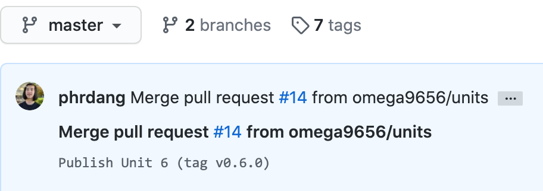

When viewing a file on GitHub, you can click on the pencil icon on the far right
to edit it in your browser. You can also delete the file by clicking on the
trash icon.

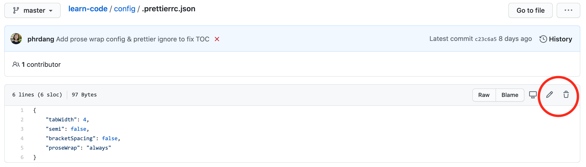

### Readme

If you scroll down below the file browser, you can read the repository's Readme
file (if there is one). The Readme usually includes information about what the
repository is, how to use it, and how to contribute to it.

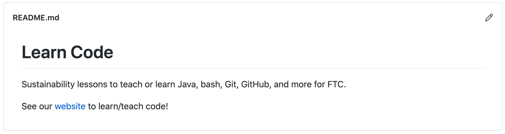

## Contributing

You have probably heard of open source software. GitHub has 2 main features that
help with this model of letting anyone contribute to software: forks and pull
requests. (They can also be used within a private team to protect the `master`
branch.)

### Forking

To understand what forking is, think about the phrase "a fork in the road." That
means that the road diverges. This is what happens when you _fork_ a
repository - it's basically a more extreme version of branching.

To be more technical about forking, it is when you make a copy of a repository
under your own account. For example, the official Learn Code repository is under
the [@omega9656](https://github.com/omega9656) GitHub account, so the "long"
name for the repo is
[omega9656/learn-code](https://github.com/omega9656/learn-code).

However, since the repository is public for anyone to view on GitHub, they can
create a fork of the repository. For example,
[@phrdang](https://github.com/phrdang) has forked the repository, so the "long"
name for _that_ repo is
[phrdang/learn-code](https://github.com/phrdang/learn-code).

To differentiate the different branches on the forks, we use the
`username:branch` notation. For example, as of August 6, 2020 1:33 PM PST,
`omega9656:master` is even with `phrdang:master`.

The reason why forks exist is to allow people who are not collaborators on the
original project to push code without messing with "official" branches.
(Technically you can still use forks if you're inside of the project team, but
it's more common for collaborators to simply have different branches that reside
in the original remote repository.)

#### How to Fork

To fork a repository on GitHub, go to the repository and click on the Fork
button in the top right corner.

### Pull Requests

Now that we have a fork, what do we do once we're satisfied that our changes are
ready to be implemented in the "official" repository? We can submit a _pull
request_ (PR) to ask the "official" repository collaborators to pull changes
from your branch (or fork) into a branch of the "official" repository (typically
`master`).

Remember that you can make PRs as an outsider (through merging a forked branch
into a branch from the original repo) or as an inside collaborator on the repo
(through merging a branch into `master`).

#### Create a PR

To create a pull request, go to the repository on GitHub, click on the **Pull
requests** tab, and click on the green **New pull request** button.

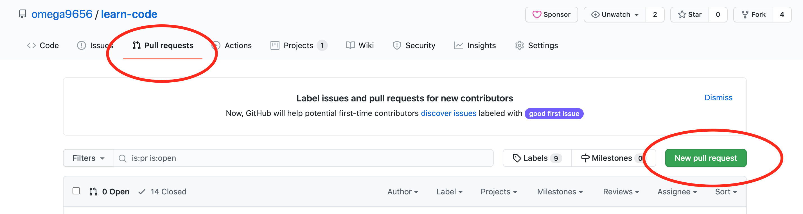

At this point, GitHub will ask you which branch you want to pull from and onto
what branch you want to merge those pulled changes. The `base:` branch is the
destination and the `compare:` branch is the branch you want to pull changes
from.

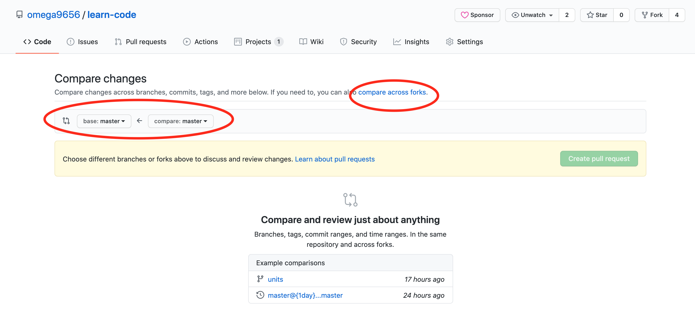

You can also compare changes across forks by clicking on the link circled in
red. If you do this, be sure to specify the base repository (repo you are
merging into) and the head repository (repo you are pulling from).

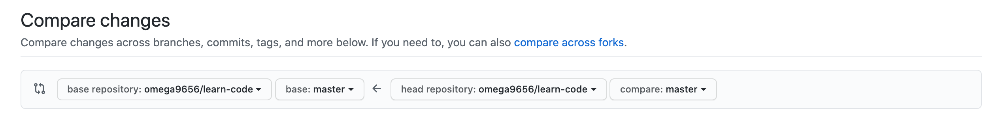

Note that you can only create a PR if there is a difference between the two
branches you're comparing. Otherwise, there's no point!

Once you've chosen the right branches/repos to compare, you can view differences
between files and then click the green **Create pull request** button to create
a PR. You will need to give your PR a descriptive title and description. Many
repos will have PR templates that you should fill out accordingly. They may also
have contributing guidelines or a code of conduct that you should read and
follow before submitting the PR.

#### After Submission

Once you submit the PR, you will be brought to the PR's unique page. The URL of
this page is the repository URL with `/pull/#` tacked to the end. `#` is
replaced by the PR's unique number. On GitHub, you can refer to a pull request
(or [issue](#issues)) using its number. GitHub will automatically link it to the
PR's page. Here's [an example]({{ site.github.repository_url }}/pull/14) of a PR
page.

At this point, you will be able to comment on the PR, push new changes to the PR
(just push normally from the `compare:` branch), or close the PR.

Inside collaborators will also be able to do all of those things, as well as
assign people to the PR,
[review](https://docs.github.com/en/github/collaborating-with-issues-and-pull-requests/reviewing-changes-in-pull-requests)
the PR, etc.

Members of the public can view PRs of public repos and comment on them. However,
they cannot submit code reviews, merge changes, or close the PR.

**Note**: Some repositories set up
[GitHub Actions](https://docs.github.com/en/actions), which allow them to
perform automatic
[status checks](https://docs.github.com/en/github/collaborating-with-issues-and-pull-requests/about-status-checks)
every time a PR is submitted or updated. Often, these status checks need to be
passed in order for merging to occur.

### Issues

GitHub also has another feature called
[Issues](https://docs.github.com/en/github/managing-your-work-on-github/about-issues)
which allows people to submit bugs or enhancements for software projects.

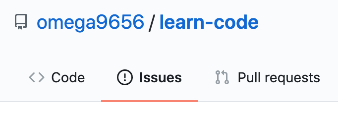

Since this isn't used very often for FTC programming (since you're not really
developing an app for someone else to use), we won't go over them. Just know
that the way you submit an issue is very similar to a PR and that they exist.
