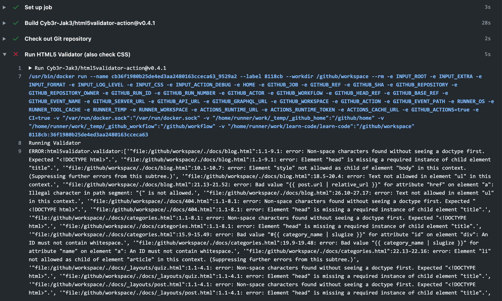

# Usage

## Prerequisites

To use the HTML5 Validator Parser, you will need to:

1. [Install Python 3](https://docs.python-guide.org/starting/installation/)
2. Copy and paste the entire error output from the HTML5 Validator. It should
   something look like this:



You can double click the box that starts with `ERROR:html5validator.validator:`
to select all the text, then use Ctrl+C or Cmd+C to copy the text.

## Parsing

1. Copy and paste the error output to `errors.txt`. It should all be on one line.
2. Run the parser via the terminal using:
```bash
$ python parse.py
# if it doesn't work try replacing python with python3
```
3. Follow instructions during the program. It should catch most input mistakes,
   but it probably won't catch all of them.

## Questions?

Message the #curr-dev channel on Discord.
